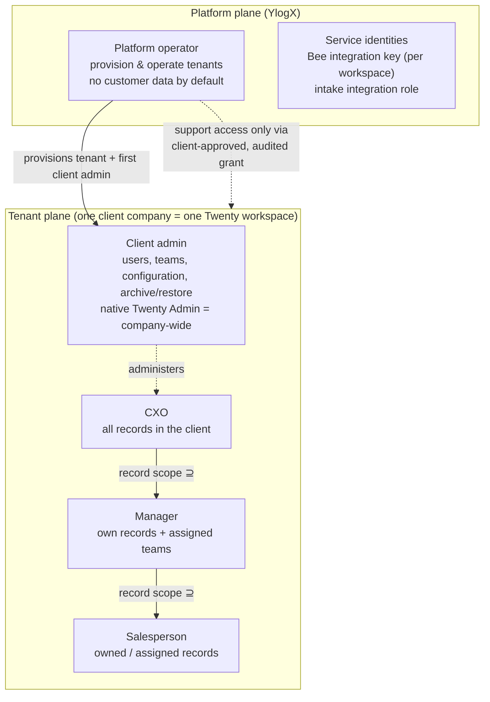
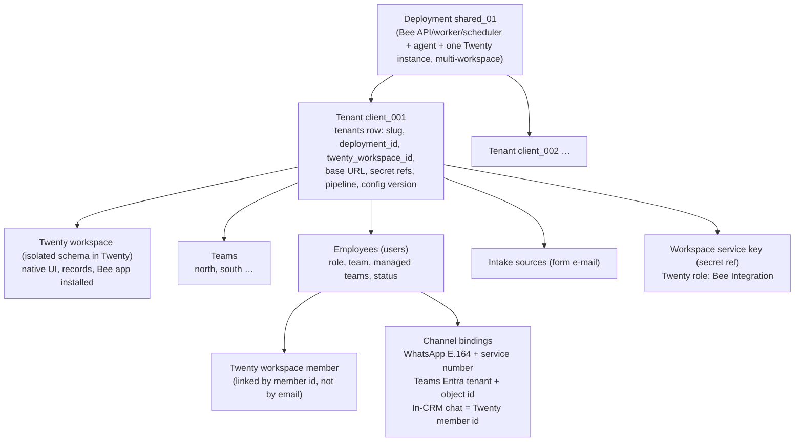
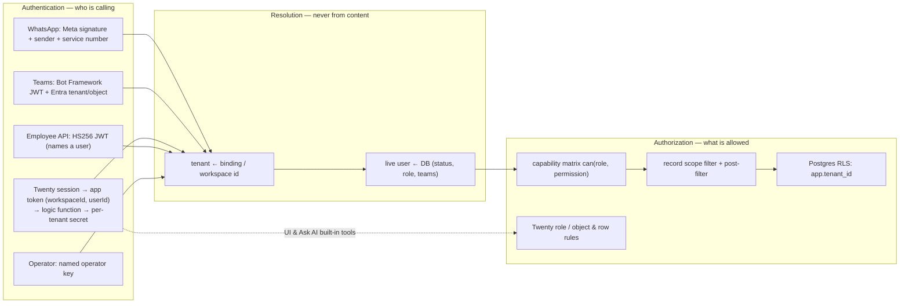

# Identity, roles and multi-tenant access architecture

Source of truth: *Conversational CRM engineering requirements v1.1* (BRD), sections 1–4, 6, 9, 11, 12 and 16–18.
Every rule below cites the BRD clause it comes from. Where the BRD is silent or ambiguous, the gap is listed in
[§10](#10-ambiguities-and-decisions) with the safest choice; nothing here adds a role the BRD does not define.

Status legend used in this document: **[exists]** already implemented before this work, **[gap]** found missing or
wrong in the earlier code, **[change]** implemented by this work (all **[change]** items are now in the code and tested).

**Decisions taken (2026-10-07):** A1 = *Bee-only* screens for salespeople and managers (no Organization key; Twenty's
row-level code is commercially licensed, so it is neither unlocked nor re-implemented inside Twenty); A2 = client admin
has administration **plus** CXO record rights; multi-workspace mode on AWS = *later*; platform operators = *internal ops
workspace* (built on the operator API below; the console needs a second workspace, i.e. the multi-workspace switch).

---

## 0. What the BRD actually defines

| Concept | BRD definition | Clause |
|---|---|---|
| Platform | One shared deployment (`deployment_id`, e.g. `shared_01`) operated by YlogX | Scope table, TEN-02, §15 |
| Tenant = client company | "one isolated Twenty workspace per client"; 25 clients × 25 users | Scope table, §1 |
| Workspace | The client's Twenty workspace. **1 tenant ↔ 1 workspace.** Shared Twenty instance in multi-workspace mode | §1 (`IS_MULTIWORKSPACE_ENABLED=true`, workspace per client) |
| Team | Group of employees inside a tenant; managers have *assigned teams* | §4 table, CFG-03 |
| Human roles | Salesperson, Manager, CXO, Client admin, Platform operator — **exactly five** | §4 table |
| Service identities | Bee service API key per workspace ("represents the integration, not the employee"); dedicated intake integration role | §4, TEN-04, IN-07 |
| Channel identity | Verified WhatsApp identity and/or Entra tenant + object ID bound to a provisioned employee | IAM-01, IAM-03 |
| Self-service | Public tenant creation disabled; first-signup restricted; controlled provisioning only | TEN-05, G1 |

## 1. Role hierarchy

The BRD defines two **separate planes**. The platform operator is *not* "above" the client roles: it administers the
service and has **no** default access to customer data (§4: "Customer-data access only through explicitly authorized,
audited support access").



Record scope is strictly nested (Salesperson ⊂ Manager ⊂ CXO). Client admin is an *administrative* role over the
same tenant; its record scope is the whole workspace because "native administrator access" is "privileged
company-wide access" (§4) — it does not inherit sales actions automatically (see [§10 A2](#10-ambiguities-and-decisions)).

**[gap]** `RolesGuard` models one numeric ladder `platform_operator > client_admin > cxo > manager > salesperson`.
That makes the operator a super-user of every tenant and lets `isRoleSufficient` grant admin rights by rank.
**[change]** replace it with an explicit capability matrix (§3) and keep the operator out of the tenant plane.

## 2. Tenant / workspace hierarchy



Rules: `tenant_id ↔ twenty_workspace_id` is 1:1 and immutable after provisioning (**[exists]** slug cannot be rebound);
a person with several client memberships has one `users` row and one binding per tenant and must choose the active
workspace (IAM-04, **[exists]**).

## 3. Role × privilege matrix

`own` = owned or assigned records · `team` = own + records of the manager's *assigned* teams · `all` = every record in
the client · `—` = denied. Scope applies to every path (search, counts, summaries, linked records, media, links).

| Capability | Salesperson | Manager | CXO | Client admin | Platform operator | BRD |
|---|---|---|---|---|---|---|
| Read / search CRM records | own | team | all | all (native admin is company-wide) | — (support grant only) | §4 |
| Capture lead, update fields, add note | own | team | all | see A2 | — | §4, §6 |
| Complete / reschedule tasks | own tasks | team | all | see A2 | — | §4 |
| Move stage | own | team | all | see A2 | — | §6 |
| Assign / reassign owner | — | within assigned teams | all | all (offboarding reassignment) | — | §4, §6, IAM-05 |
| Request archive | ✔ (request only) | ✔ | ✔ | ✔ | — | §4 |
| Approve archive / restore | — | team | all | all | — | §4 |
| Permanent delete | — in chat; native destroy disabled | — | — | native Admin only (documented) | — | §4 |
| Scoped summaries / reports | personal | team | company | company | — | SUM-01 |
| Intake review approve / reject | — | items routed to their teams | all | all + unassigned queue | — | IN-10, IN-11, AT-20 |
| View own operations | ✔ | ✔ | all in tenant | all in tenant | ops metadata only | §9 |
| Manage users, roles, teams | — | — | — | ✔ own tenant | first client admin at provisioning | §4 |
| Issue / revoke channel enrollment | — | — | — | ✔ | at provisioning | IAM-01/02/05 |
| Tenant configuration (pipeline labels, hours, reminders, intake) | — | — | — | ✔ own tenant (versioned) | ✔ via manifest | CFG-01..04 |
| Read audit trail | own actions | — | — | ✔ own tenant | ✔ operational, no payloads | SEC-03 |
| Approve support access | — | — | — | ✔ | requests it | §4 |
| Create / suspend tenants, rotate service keys | — | — | — | — | ✔ | TEN-05, SEC-01 |
| Dead letters, usage, reconciliation | — | — | — | usage of own tenant | ✔ | §11 |

Twenty-native mapping (same matrix, enforced by Twenty for the web UI and its Ask AI tools):

| Twenty role (created by Bee) | Objects | Settings | Notes |
|---|---|---|---|
| **Bee · Client admin** → Twenty *Admin* | all | all | Company-wide by design; documented to the client (§4) |
| **Bee · CXO** | read/update/soft-delete all; no destroy | none | Export allowed (company scope) |
| **Bee · Manager** | depends on licence (A1) | none | Row-level rule "owner = me OR team ∈ my teams" needs an Organization key |
| **Bee · Salesperson** | depends on licence (A1) | none | Row-level rule "owner = me" needs an Organization key |
| **Bee · Revoked** | none | none | Assigned on revocation (IAM-05) |
| **Bee Integration** (API key) | read/update/soft-delete all; no destroy | data model, roles, members | Service identity; Bee enforces employee scope (§4) |
| **CRM Bee app** (logic functions) | read `workspaceMember` only | none | **[change]** was able to read all objects |
| **Bee service user** (Admin seat) | — (not used for records) | member roles, workspace settings | Twenty accepts these two only from a user session, never from an API key or app (verified on v2.45); Bee signs in as this service identity for exactly that |

## 4. User provisioning and access flow

```mermaid
sequenceDiagram
  autonumber
  participant PO as Platform operator
  participant Bee as Bee API
  participant TW as Twenty (server admin)
  participant CA as Client admin (in Twenty)
  participant E as Employee
  PO->>TW: create workspace (server-admin only; public signup off)
  PO->>Bee: POST /admin/tenants (manifest: workspace id, key ref, pipeline, first client admin)
  Bee->>TW: verify key belongs to that workspace; ensure schema, roles, app
  CA->>Bee: Bee Admin › Users › Add (name, email, role, team)
  Bee->>TW: send workspace invitation
  E->>TW: accepts invite (Twenty login)
  Bee->>TW: link member id ↔ user; assign mapped Twenty role
  CA->>Bee: issue WhatsApp/Teams enrollment code (approver recorded)
  E->>Bee: sends code from own WhatsApp/Teams account → binding
  E->>Bee: uses Ask AI › Bee inside Twenty (identity = Twenty member id)
  CA->>Bee: role/team change or revoke
  Bee->>Bee: cancel drafts & schedules, revoke bindings (immediately)
  Bee->>TW: re-map Twenty role (Revoked), within the 5-minute bound (IAM-05)
```

* **No public signup** (TEN-05, G1): Twenty `IS_WORKSPACE_CREATION_LIMITED_TO_SERVER_ADMINS=true` (default), Bee has no
  signup route. **[change]** the access sync keeps the workspace's public invite link **off**, impersonation **off** and
  the default role for new joiners at **Bee · No access** (found: *Member* = read/update/destroy everything, link on).
* **Linking is by verified member id**, never by e-mail text. **[gap]** today the in-CRM chat auto-binds by e-mail;
  any member whose e-mail matches a Bee user becomes that user.
* **Enrollment codes** are single-use, expiring, hashed, issued by a client admin (approver recorded) **[exists, now
  issuable by client admins]**.
* **Change / revoke** (IAM-05): every request re-reads the live user **[exists]**; drafts and reminders are cancelled
  **[exists]**; **[change]** the Twenty role is re-mapped and a reconciliation job re-applies it every 5 minutes.

## 5. Authentication vs authorization



Authentication only establishes *an identity*; authorization is decided on every request from live state. Tokens never
carry authority on their own (a JWT names a user; role and status are re-read — **[exists]**). Model output, message
text, URLs and e-mail headers can never select a tenant or a user (TEN-01, SEC-02 — **[exists]**).

**[gap]** the in-CRM chat uses one deployment-wide `CRM_CHAT_TOKEN`. Anyone holding it could assert *any* workspace.
**[change]** each tenant gets its own derived secret (HMAC of a master key and the tenant id); a secret from tenant A
cannot speak for tenant B. **[gap]** the operator API uses one shared key and records every action as
`platform_operator`. **[change]** named operators with individual keys; every action audited with the operator's id.

## 6. Multi-tenancy and data isolation

| Layer | Mechanism | Status |
|---|---|---|
| Twenty records | Separate workspace per client on a multi-workspace instance; per-workspace service key | **[exists]** per tenant; **[change]** provisioning verifies the key really belongs to the workspace and rejects a key ref already bound to another tenant |
| Bee database | `tenant_id` on every row, `FORCE` RLS, transaction-local `app.tenant_id`, non-superuser runtime role | **[exists]** on 17 tables; **[change]** also on `teams`, `support_grants`, `archive_requests`; `platform_operators` readable only in a system transaction. The `tenants` registry stays outside RLS by design: tenant resolution must look it up before a tenant is known, and it holds secret *references*, never secrets |
| Environments | Local development uses its own Postgres (`crmbee-pg`), AWS uses Supabase | **[change]** they shared one database and the local worker relayed AWS jobs from the shared outbox |
| Queue / cache | Jobs carry tenant id; Redis keys prefixed; chat inbox keyed by workspace + member | **[exists]** |
| Media | Tenant-prefixed object keys, short-lived signed links | **[exists]** |
| Identity | Bindings unique per (channel, connection, external id, tenant) | **[exists]** |
| IDs | Cross-tenant ids resolve to *not found* | **[exists]** |

## 7. Database-level and API-level enforcement

**Database.** RLS isolates tenants; *within* a tenant, record scope is a CRM concern because CRM records live in Twenty.
Bee's own per-user rows (drafts, operations) are filtered by `user_id` in every query and return 404 otherwise.
The audit log is append-only by trigger **[exists]**; operators cannot edit it.

**API surface after this change.**

| Route group | Caller | Guard chain |
|---|---|---|
| `/health*` | anyone | public |
| `/webhooks/*`, `/intake/*` | providers | signature / recipient verification |
| `/drafts/*`, `/operations/*`, `/intake/review/*` | employee | JWT → live actor → `@RequirePermission` → scope |
| `/v1/crm-chat/*` | Bee app in Twenty | per-tenant secret → member link → live actor |
| `/v1/tenant-admin/*` **[change]** | client admin (via Bee app in Twenty) | per-tenant secret → member link → `@RequirePermission('users.manage' …)` |
| `/admin/*` | named platform operator | operator key → operator permissions; customer data only with an active support grant |

**Every path is checked**: search, counts, summaries, linked records (notes/tasks of a visible company owned by another
salesperson are hidden — **[exists]**), media links, CRM links, exports (none in chat), and intake review.

## 8. Admin and super-admin boundaries

**Platform operator (YlogX)** — may: create/suspend tenants from a manifest, create Twenty workspaces (server admin),
rotate service keys, run reconciliation, read dead letters and usage, request support access. May **not**: read or
change CRM records, read drafts/transcripts/media, mint user tokens, or impersonate users — except while a support grant
the client admin approved is active (time-boxed, read-only by default, every access written to that tenant's audit log
the client admin can read). **[gap]** `/admin/tenants/:id/users/:userId/token` lets the operator act as any employee;
**[change]** it now requires an active grant (and test environments).

**Client admin** — may, for their own tenant only: invite/link/revoke users, set roles (including client admin; the
last active client admin cannot be removed), define teams and managers' assigned teams, issue/revoke enrollment codes,
edit configuration (versioned, previewed for stage removal per CFG-04), approve archive/restore and intake reviews,
read the audit trail, approve or end support grants. May **not**: create tenants, rebind the workspace, see service
secrets, or reach any other tenant. Native Twenty *Admin* powers are company-wide and are documented as such (§4).

## 9. Implementation (done)

Code map: `src/access/` (matrix, guards, decorators, per-tenant app secret, user directory, operators & support grants,
HTTP controllers `/v1/me`, `/v1/approvals`, `/v1/tenant-admin`), `src/approvals/archive-request.service.ts`,
`src/crm/twenty/twenty-access.service.ts` (native roles/settings/member sync), `src/admin/tenant-config.service.ts`,
`migrations/0003_access_control.sql`, `twenty-app/` (*Bee* page: My Bee · Approvals · Users · Teams · Settings ·
Security & audit; `ask-bee` and `bee-api` functions), scripts `twenty-service-user.mjs` and `twenty-harden.mjs`.
Tests: `test/integration/access-control.spec.ts` (15 scenarios over HTTP) plus updated unit/integration/e2e suites.

Onboarding a client (operator):
1. Create the Twenty workspace (server admin) and the integration key (`scripts/twenty-bootstrap.mjs`).
2. Create the Bee service user (`scripts/twenty-service-user.mjs`), store its password as a secret, reference it in the
   manifest (`twenty.serviceUser`).
3. Install the CRM Bee app in the workspace (`twenty apply` / private publish), then `POST /admin/tenants` with the
   manifest: Bee links the listed employees, creates the Bee roles, hardens the workspace, assigns member roles and
   configures the app with **this tenant's** secret. Re-run any time; it is idempotent.

Original change list (kept for traceability):

1. **Policy core** — `src/access/`: `Permission` catalog, `ROLE_PERMISSIONS` matrix (§3), `can()`, `@RequirePermission`,
   `PermissionGuard`; remove the numeric ladder; operator is not a tenant role.
2. **Stable ownership key** — **[gap]** `ownerKeyOf = twentyMemberId ?? userId` changes when a member is linked, which
   would hide a salesperson's existing records from them. Use the Bee user id permanently; also set Twenty's native owner
   fields (`owner`, `accountOwner`, `assignee`) to the linked member for the native UI.
3. **Teams table** with RLS; users reference teams; managers' assigned teams validated.
4. **Twenty member link** — `users.twenty_member_id` set by the client admin (pick from members) or on invite acceptance;
   in-CRM chat resolves by member id; e-mail auto-binding removed.
5. **Per-tenant chat secret** derived from a master key.
6. **Tenant-admin API** `/v1/tenant-admin/*` (users, teams, roles, enrollment, revoke, config, approvals, audit, support
   grants) for client admins only.
7. **Archive requests** — salesperson "request archive" becomes a pending request a manager/CXO/client admin approves.
8. **Intake review scope** — managers see/approve items routed to their teams; unassigned items go to the client-admin
   queue (IN-10).
9. **Operators & support grants** — named operator keys, `support_grants` table, audited; token minting gated.
10. **Twenty role sync** — provisioning creates the Bee roles, maps members, disables destroy for non-admins, narrows
    the Bee app role, verifies signup/invite settings; a reconciliation job re-applies roles (drift → audit).
11. **In-CRM administration** — the CRM Bee app gets a *Bee Admin* page (client admins) and a *My Bee* page (every
    employee: profile, channels, enrollment status) inside Twenty, backed by the tenant-admin API.
12. **Tests** for every matrix row, cross-tenant attempts through each route, revocation timing and drift.

## 10. Ambiguities and decisions

| # | Ambiguity in the BRD | Decision / safest default |
|---|---|---|
| A1 | Native UI row-level scope for salespeople/managers needs Twenty's Organization (Enterprise) key (§1 G2, S3); this release ships the feature but enforces it only with a valid key | **Decided: Bee-only.** Salesperson/manager Twenty roles have **no record access** (verified: Twenty returns PERMISSION_DENIED on REST and GraphQL); they work through Ask AI › Bee, WhatsApp and Teams, where Bee enforces scope. Meets "do not release with middleware-only filtering" (§1) |
| A2 | Client admin's allowed actions list administration and archive/restore, not record creation/updates | **Decided:** administration + CXO record rights (matches the native Admin's real powers, which §4 says must not be understated) |
| A3 | Manager review rights for intake items not routed to their team | Only items routed to their teams; unassigned items go to the client-admin queue |
| A4 | Mechanism for "explicitly authorized, audited support access" | Client-admin-approved, time-boxed (default 4 h), read-only grant; every access audited in the tenant's trail |
| A5 | Whether the native Twenty *Admin* is always the Bee client admin | Yes: Bee client admin ↔ Twenty Admin; anyone else holding Twenty Admin is reported as drift |
| A6 | Who owns roles when Twenty and Bee disagree | Bee is the source of truth; drift is re-applied and audited |
| A7 | Removing the last client admin | Refused |
| A8 | Twenty refuses member-role assignment and workspace settings to API keys and apps | A dedicated Bee service user (Admin seat) per workspace, used only for those two operations; documented as a service identity alongside the integration key |
| A9 | A decision taken in Twenty's own Intake Review view | Counts only if the Twenty member is linked to a Bee user allowed to review that item; otherwise ignored and audited |
